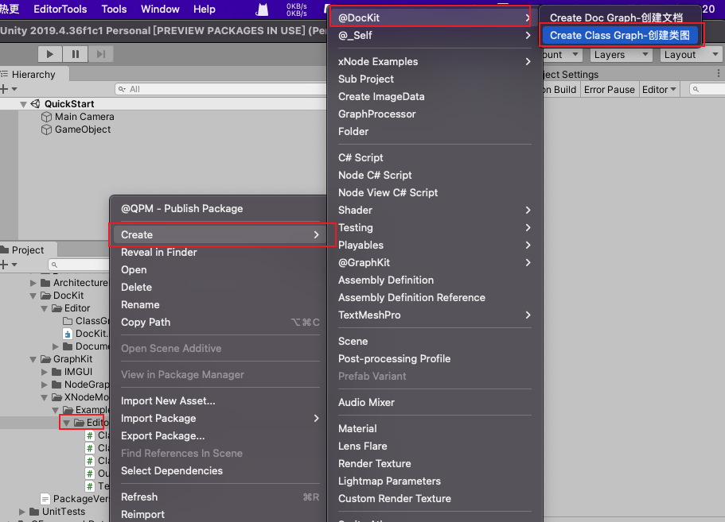
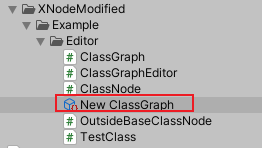
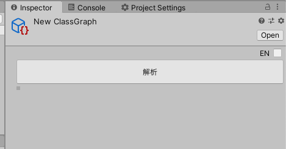
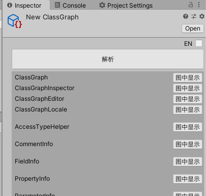
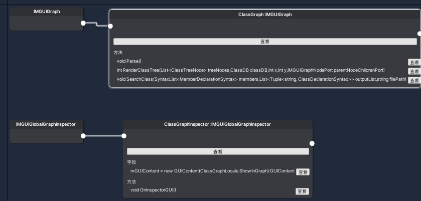
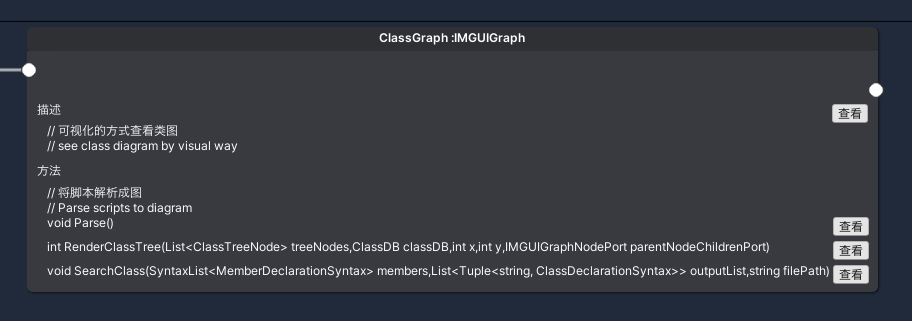

DocKit 除了支持写文档还支持根据某个目录的代码 生成简单的继承类图

使用方式非常简单

只需对任意有代码的目录右键，选择 @DocKit/Create Class Graph 操作如下

创建之后，如下所示:

我们先看它的 Inspector 如下

我们可以看到解析按钮，点击它，结果如下:

可以看到，在解析按钮下边列出了当前目录的所有的类。

同时也打开了一个新的窗口，如下:

这时已经生成好了，类图。

类图只是简单的类图，可以看到类的概要，以及简单的继承关系。

对于图中的 ClassGraph 类，我们可以点击查看按钮来打开代码编辑器，如下:

我们来对这个类已经方法写随便写一点注释，如下。

接着我们回到类图编辑器，右键重新加载，看到我们的 ClassGraph 类图变成如下

这样就可以边写一些注释边去阅读源码了。

